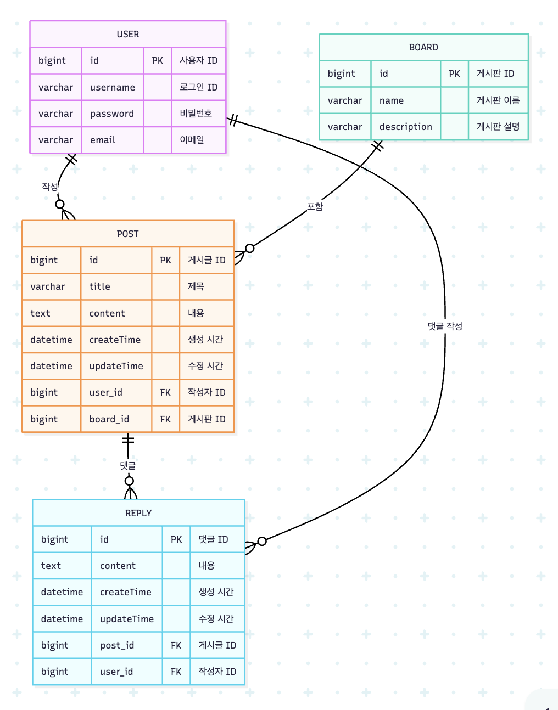

##  스프링 CRUD 게시판 스터디 보고서 (2025-12-09)

###  현재 프로젝트 상태

* Repository URL: https://github.com/chaeun99/board-project/tree/develop

---

###  오늘 완료한 작업

#### 1. 데이터 모델링 및 엔티티 구축

* ERD(Entity Relationship Diagram) 작성
  
* `Board` 엔티티 추가 완료
* `Reply` 엔티티 마무리 (필드 및 연관관계 설정)
* 4개 엔티티(User, Board, Reply 등)에 대한 Repository 인터페이스 생성 완료

#### 2. User 모듈 구현

* `UserDto` (요청/응답 DTO) 정의
* `UserService` 구현
* `UserController` 구현 - 회원가입 (`POST`) 기능 완료

---

###  코드 피드백 및 논의 사항

#### 1. UserDto.Response에 생성된 ID 반환이 필요한가?

회원가입 성공 시, `UserDto.Response`에 회원 고유 번호(ID)를 포함해서 클라이언트에게 반환해야 하는지에 대한 얘기가 나왔습니다. 결론적으로, ID를 반환하는 것이 필요합니다. 이는 RESTful API의 원칙을 따르는 것으로, 자원 생성(`POST`) 성공 응답(`201 CREATED`)에는 생성된 자원의 식별자를 포함해야 합니다. 클라이언트는 이 ID를 이용해 이후 자원 조회, 수정, 삭제 요청을 할 수 있게 됩니다.

#### 2. `@NoArgsConstructor`와 `@Builder` 충돌 해결

`@NoArgsConstructor`와 `@Builder` 어노테이션을 함께 사용할 때 충돌이 발생하는 현상에 대해 논의했습니다. 원인은 `@Builder`가 모든 필드를 인자로 받는 생성자를 기반으로 객체를 생성하려 하는데, `@NoArgsConstructor`만 있으면 이 생성자를 찾지 못하기 때문입니다.

#### [해결책]
1.  `@AllArgsConstructor`을 함께 사용 => 빌더가 필요로 하는 전체 필드 생성자를 제공해줌
2.  모든 필드를 받는 생성자를 직접 명시적으로 만들기

JPA 엔티티 사용 시 권장되는 방법은 `@NoArgsConstructor(access = AccessLevel.PROTECTED)`와 `@AllArgsConstructor`를 함께 사용하는 것. 이는 JPA가 요구하는 기본 생성자를 제공하면서도, `protected` 접근 제한자를 통해 외부에서 임의로 객체를 생성하는 것을 방지하여 엔티티의 안정성을 높임

---

###  다음에 할 일

* DTO 설계 완성 
  * 나머지 DTO (사용자 정보 수정 요청 DTO 등) 정의 및 ERD를 바탕으로 `Board` 및 `Reply` 관련 DTO 계획 상세화.
* UserController CRUD 마무리 
  * 사용자 단건 조회 (`GET /{userId}`), 사용자 정보 수정 (`PUT/PATCH /{userId}`), 사용자 삭제 (`DELETE /{userId}`) 기능 구현. 
* Board 파트 시작
  * 게시글 CRUD (작성, 조회) 기능 구현 착수.